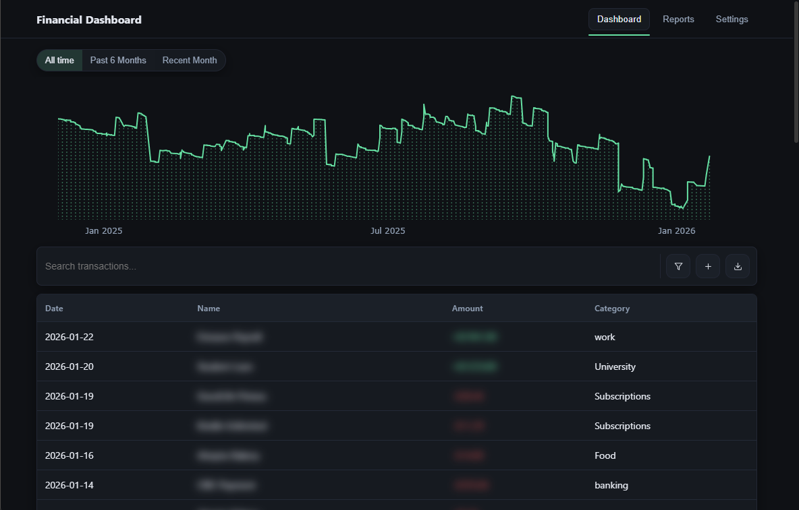

# Financial Dashboard


A private offline desktop app that converts bank PDF statements into an interactive financial dashboard.



## Features

- **PDF Statement Parsing** — Drop credit/debit bank statements and auto-extract transactions
- **Interactive Charts** — Balance trends, category breakdowns, merchant analysis, and 3-month trend forecasting
- **Reports & Analytics** — Category net totals over time, association analysis (Apriori), and spending pattern insights
- **Privacy-First** — Fully offline, local data storage, built-in blur mode
- **Dark/Light Themes** — Full theme support
- **Custom Filters** — Ignore lists to exclude internal transfers or irrelevant postings
- **Search & Export** — Filter transactions and export data

## Setup

**Prerequisites:** [Node.js](https://nodejs.org/) v18+ and [Python](https://www.python.org/) v3.8+

```bash
git clone https://github.com/yourusername/financial-dashboard.git
cd "Financial Dashboard"
npm install
pip install -r requirements.txt
npm run build:ui
```

## Usage

```bash
npm start
```

1. Import PDF bank statements via the UI or place them in the `Credit/` / `Debit/` directories
2. The Python engine processes PDFs into CSVs automatically
3. The dashboard visualizes your transaction data

## Disclaimer

This tool is for personal financial management only. It is not financial advice. Always verify data against your official bank statements. No external API connections, it only processes files you provide.

## License

[MIT](LICENSE)
